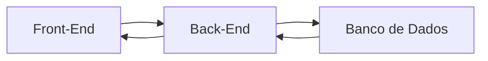

# Meu curso desenvolvimento com antigravity

** Inicio**19/09/26
**local**: Escola SENAI Americana

## modulo 1 - introdução e nivelamento

- Hardware, software e sistemas operacionais

- Preparando o ambiente de desenvolvimento
    - VScode: Editor de testo / Ide
    - Criação da workspace;
    - Arquivos e extensões;
    - software de versionamento
        > Versionamento: processo  de registrar todas as alterações feitas no arquivos de um projeto ao longo do tempo
        - Git : versionamento local;
### configurando o git e o github
conetctar o git ao github, digitar o seguinte  comando no bash/cmd:
`git config --global user.name "seuusername"`
`git config --global user.email "seu@maile.com"`

confirmar com o comando:
`git config --list`

### O processo de Desenvolvimento
** como um software eh feito**
* Programar é dar ordens extremamente detalhadas e lógicas para o computador. Eh como escrever uma receita de bolo passo a passo.

** Arquitetura de um software**
* front-end (interface): é tudo eu o usuario ve e interage.
* back-end(é o cerebro): eh a cozinha do restarante, recebe as requisições. Processo de acordo com a logica. E devolve uma resposta para a UI(user interface).
* Banco de Daodod(a memoria): é onde guardamos as informações pemanentes: loguins, senhas, mensagens.....

### Meu primeiro projeto Antigravity

**O Contexto (O que vamos Construir)**

* Gerenciador de Tarefas: HTML, CSS, JavaScript

* O Projeto para o Antigravity:

Copie e cole no assistente do Antigravity:

"Atue como um desenvolvedor web sênior. Quero criar um aplicativo de 'Lista de Tarefas' simples e bonito. Por favor, gere os 3 arquivos necessários (HTML, CSS e JavaScript) seguindo estas regras:
1. Front-end (Interface - HTML e CSS):
Crie um título centralizado chamado 'Meu Dia'.
Crie um campo de texto para digitar a tarefa e um botão azul escrito 'Adicionar'.
Abaixo, crie uma lista onde as tarefas vão aparecer.
Use um design moderno, com cantos arredondados e fundo claro.
2. Back-end/Lógica (JavaScript):
Quando eu clicar em 'Adicionar', a tarefa deve ir para a lista.
Se o campo estiver vazio, mostre um alerta pedindo para digitar algo.
Coloque um botão vermelho de 'Excluir' do lado de cada tarefa.
3. Banco de Dados / Memória:
Use o 'LocalStorage' do navegador para salvar as tarefas. Assim, se eu fechar a página e abrir de novo, minhas tarefas ainda estarão lá.
Forneça o código completo e separado de cada arquivo."
